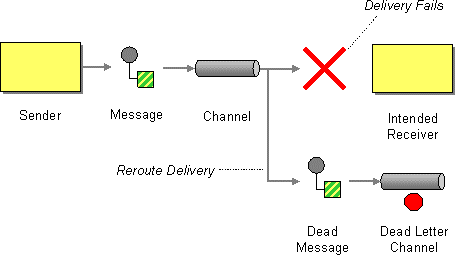

- title : Advanced Messaging Patterns
- description : Support presentation for Advanced Messaging workshop
- author : Karel Šťastný
- theme : night 
- transition : none

***

# Advanced Messaging Patterns

***
## Patterns Overview

Source: <a href="https://www.enterpriseintegrationpatterns.com/patterns/messaging/">https://www.enterpriseintegrationpatterns.com/patterns/messaging/</a>

' cover pattern areas, this talk will focus on Messaging Endpoints and partially Systems Management

***

## RabbitMQ Messaging

* use one connection per application
* use one channel per thread
* use separate channel for publishing and consuming
* limit queue size
* queues should be mostly empty

' connections and channels long lived
' per thread - I'd say per worker since a lot of stuff might be async
' tips https://www.cloudamqp.com/blog/2018-01-19-part4-rabbitmq-13-common-errors.html and https://www.cloudamqp.com/blog/2017-12-29-part1-rabbitmq-best-practice.html

***

> Exercise 1 - Message Publishing

* create database tables using script `000CreateTables.sql`
* setup connection string in `appsettings.json`
* complete TODOs in the solution `exercise-1`

' the point is to send a message to everyone when new orc warrior is born 
' proof: listener in presenters computer
       

***

### Publishing Messages

* routing information - exchange, routing key
* always set ContentType
* message Type
* `mandatory` messages
* `persistent` messages
* identify client connection, identify sender

' properties - message type, Id, TTL, custom headers
' The type property on messages is an arbitrary string that helps applications communicate what kind of message that is (e.g. allow proper deserialization and handling)

***

### Declaring Exchanges and Queues

* at the publisher side
* at the consumer side
* separately

' my opinion - declaring on both makes sure that both sides' expectations are correct
' but - needs to correctly sync and some decisions are not meant to be done by that side
' earlier I used to do on both sides. Now I'd say either define queues completely elsewhere, or for commands and RPC - consumer only. For events - publisher only
' very much depends on the design of the queues

***

### Failures in Publishing

* network failure, firewall problems
* broker failure
* logic errors in client application cause connection or channel closing

' firewall - interrupts idle connection even after it is ok
' conn or channel closing - we should implement reconnect ourselves (Rabbit client only does it for network problems, not closed channel). out of scope

***

### Failures in Publishing

* if unsure, producer should publish the message again
* set messages and queues as durable
* use publisher confirms

' republish - with the same MessageId! leads to duplicates

***

### Failures in Publishing

* how to handle unavailable broker and keep the business operation working?
* how to handle failed business transaction and publish messages atomically?

***

> Demo - Publishing Trouble

' "Lost Send" - message not sent even when transaction is commited
' "Premature Send" - sending message before transaction is commited
' broker stops transaction - if unavailable, this is a reason for rollback 

***

### Solutions

* Distributed transactions, two phase commit
* Outbox

' distributed transactions - slow, possible. see https://stackoverflow.com/questions/11739265/txselect-and-transactionscope
' outbox simulates the reliability of distributed transactions without requiring use of the Distributed Transaction Coordinator
'  atomicity of business operation (operations *all* occur or *nothing* occurs)

***

### Outbox

Source: <a href="https://www.enterpriseintegrationpatterns.com/patterns/messaging/GuaranteedMessaging.html">https://www.enterpriseintegrationpatterns.com/patterns/messaging/GuaranteedMessaging.html</a>

' http://gistlabs.com/2014/05/the-outbox/
' implied by this https://www.enterpriseintegrationpatterns.com/patterns/messaging/GuaranteedMessaging.html - leads to the fact, that it is the same as "Inbox" 
' business data and outbox must exist in the same database! https://docs.particular.net/nservicebus/outbox/

***

### Outbox Usage

* Commands
* Integration Events

' query/RPC imo not necessary, we need answer relatively soon
'  Integration Event - used to synchronize information about domain state between different microservices (if one service = one bounded context)

***

### Inbox

' see https://docs.particular.net/nservicebus/outbox/ - when receiving messages. deduplication - duplicates are dropped

***

> Exercise 2 - Outbox

* complete TODOs in the solution `exercise-2`

*** 

> Exercise 3 - Message Consumption

* complete TODOs in the solution `exercise-3`
* tip - add separate exchange and queue for handling commands so others messages don't interfere with yours when testing

' every tribe receives commands from the supremene chieftain and acts on them
' preparation - every tribe does it
' quest - only one tribe tries to fulfill it

***

### Message Consumption

* exclusive vs shared queue
* manual vs automatic ACK
* prefetch values

' shared queue - commands, RPC. exclusive - events. differs in bindings
' manual vs automatic, when to use what 
' automatic - client receives everything, might be overloaded if there are many messages, messages may be lost
' see https://www.rabbitmq.com/consumers.html and https://www.rabbitmq.com/confirms.html

***

### Failures in consumption

* `receive` |> `deserialize` |> `toDomain` |> `handle` |> `confirm`

* Poison message
* Consumer failure

***

> Exercise 4 - Retry

' directly continues with solved Exercise 3

***
### Dead-Letter Queue

Source: <a href="https://www.enterpriseintegrationpatterns.com/patterns/messaging/DeadLetterChannel.html">https://www.enterpriseintegrationpatterns.com/patterns/messaging/DeadLetterChannel.html</a>

***

### Handling Dead-Lettered Messages

* Monitor and Decide
    * Abandon
    * Retry manually 
    * Fix Consumer and retry

' suggestion: at first, monitor the dead letter exchange and decide based on what kind of messages end up there    
' in practice poison and dead messages may end up in the same queue, you decide :)    

***

## Monitoring

* e.g. what is happening in the system?
    * who is connected
    * who is sending what messages + history
    * who is processing what messages + history

NOTE: we don't care about monitoring the messaging system itself, rather the message flow

' I want to show patterns that interested me and where we could use them.

***

### WireTap

Source: <a href="https://www.enterpriseintegrationpatterns.com/patterns/messaging/WireTap.html">https://www.enterpriseintegrationpatterns.com/patterns/messaging/WireTap.html</a>

***

### Smart Proxy

Source: <a href="https://www.enterpriseintegrationpatterns.com/patterns/messaging/SmartProxy.html">https://www.enterpriseintegrationpatterns.com/patterns/messaging/SmartProxy.html</a>

***

### Message History

Source: <a href="https://www.enterpriseintegrationpatterns.com/patterns/messaging/MessageHistory.html">https://www.enterpriseintegrationpatterns.com/patterns/messaging/MessageHistory.html</a>

***

> Exercise 5 - ???

' peoples choice, depending on time

*** 

## Discussion